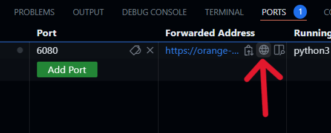

# Evodoodle 


Draw your own custom landscapes and watch as your species evolves across them! Evodoodle is a drawing game for learning how evolution plays out across landscapes. Evodoodle allows you to control population density, connectivity, and selection across space and then simulates evolution using Geonomics, a powerful landscape genomic simulation package.

# Setup

Evodoodle can either be run locally on your own computer or right in your browser using GitHub Codespaces.

## Running evodoodle on your own computer

First, clone or download this repository by clicking the green CODE button. Once inside the evodoodle directory, you can then use the [evodoodle.yml](evodoodle.yml) file to set-up a conda environment and install the required packages

```bash
conda env create -f evodoodle.yml
conda activate evodoodle
```

You can also manually install the required packages:
```bash
pip install numpy
pip install matplotlib
pip install seaborn
pip install geonomics
pip install pygame
```

## Running evodoodle in GitHub Codespaces

GitHub codespaces provides a cloud-based environment for running evodoodle right in your browser. To start a GitHub codespace, **click the green CODE button in the upper-right corner of this repository and select `Open with Codespaces`.** This will open a new codespace in your browser with all the required packages installed and ready to go. For more information on codespaces check out the [GitHub documentation](https://docs.github.com/en/codespaces). 

GitHub codespaces by default uses Visual Studio Code, a popular open-source code editor. To get started, open `quick_demo.py` or `evodoodle_notebook.py` by clicking on the file in the file explorer (left-hand side of the screen). You can run chunks by clicking "run chunk" or by pressing `shift + enter` (or `shift + return`) when the chunk is selected. This will open an interactive display on the right-hand side of the screen. You can download files from your codespace by right-clicking on the file in the Explorer panel and clicking `Download...` and you can upload files by right-clicking in the Explorer panel and selecting `Upload...`.

**BEFORE YOU START: Evodoodle requires an interactive display for drawing which takes a few simple steps to set-up on codespaces.** We have a virtual desktop which you can acccess by:
1. Clicking the `Ports` tab at the bottom of the screen in codespaces
2. Find the `desktop (6080)` port in the list (it should be the first one)
3. Click `Open in Browser` in the `Forwarded Address` column for `desktop (6080)` (click the button that looks like a globe next to the link or `Ctrl + click` the link). 
   


4. This will open a new tab with the interactive display called noVNC. To start the display click `Connect`. The screen will initially appear blank, but **when you run the code to draw a landscape (i.e., run `draw_landscape()`) the landscape will appear in the noVNC display tab. Once you have drawn your landscape, click `SAVE` and the code will continue in your codespace tab.**

*Cost of codespaces*: GitHub Free personal accounts come with 120 codespace core hours per month for free. When a personal account hits its limit and has no spending limit configured, use of GitHub Codespaces will be blocked (so don't worry about accidentally running up a bill). For more information on pricing check out the [GitHub billing](https://docs.github.com/en/billing/managing-billing-for-github-codespaces/about-billing-for-github-codespaces#about-github-codespaces-pricing). Our codespace uses 2 cores, so you can run it for 60 hours per month for free (or more if you have a Pro account).

# Quick start

To start evodoodle, simply run the following code. Whenever `draw_landscape()` is run a pop-up will appear that allows you to draw on a landscape. Once you have drawn your landscape, click `SAVE` and the code will continue:


<br>

```python
import matplotlib.pyplot as plt
import numpy as np
import seaborn as sns 
import geonomics as gnx
from evodoodle import init_mod, draw_landscape, edit_landscape, plot_popgen, plot_landscapes
from gnx_params import params
import geonomics as gnx

# Draw landscapes
population_size = draw_landscape(d = 10)
connectivity = draw_landscape(d = 10)
environment = draw_landscape(d = 10)

# Plot the landscapes
plot_landscapes(population_size, connectivity, environment)

# Start the model
mod = init_mod(params, population_size, connectivity, environment)

# Run the model for 200 steps
mod.walk(200)

# Plot the results
plot_popgen(mod)

# From here you can continue to run the model for more steps and plot the results
```


For a more in-depth walkthrough and some fun challenges, check out the [evodoodle_notebook.ipynb](evodoodle_notebook.ipynb) jupyter notebook
