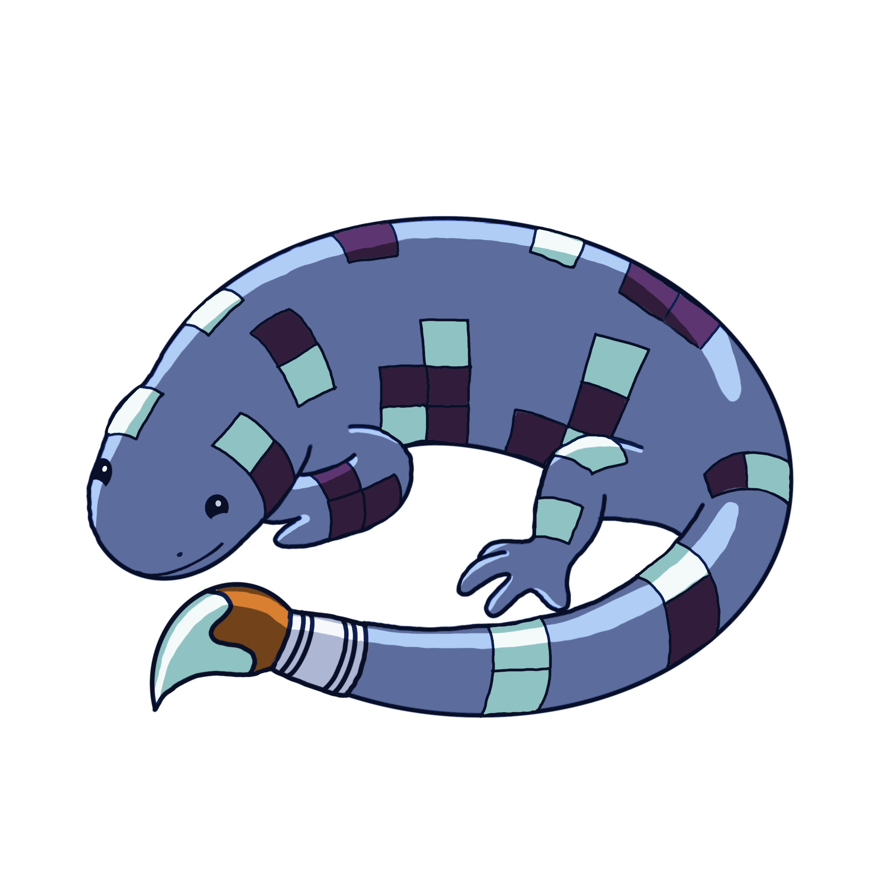
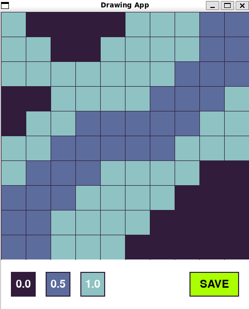
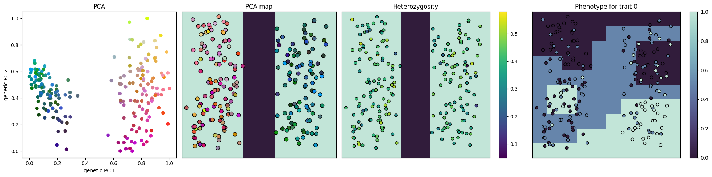

# Evodoodle 


Draw your own custom landscapes and watch as your species evolves across them! Evodoodle is a drawing game for learning how evolution plays out across landscapes. Evodoodle allows you to control population density, connectivity, and selection across space and then simulates evolution using Geonomics, a powerful landscape genomic simulation package.

# Setup

First, clone or download this repository. Once inside the evodoodle directory, you can then use the [evodoodle.yml](evodoodle.yml) file to set-up a conda environment and install the required packages

```bash
conda env create -f evodoodle.yml
conda activate evodoodle
```

You can also manually install the required packages:
```bash
pip install numpy
pip install matplotlib
pip install seaborn
pip install geonomics
pip install pygame
```

Or use the Docker image:
```bash
 docker pull ghcr.io/anushapb/evodoodle:latest
```

If you are using [Visual Studio Code](https://code.visualstudio.com/) and have [Docker](https://code.visualstudio.com/docs/devcontainers/containers) installed on your computer, this repository is set-up so that you can open it within a container with everything ready-to-go. First, clone or download this repository. Then, in VS Code:

1. Install the `Dev Containers` extension
3. Open the Command Palette (`Ctrl+Shift+P` or `Cmd+Shift+P`).
4. Type `"Remote-Containers: Open Folder in Container..."` and select it
5. Navigate to and select the evodoodle folder

For more detail instructions see [here](https://code.visualstudio.com/docs/devcontainers/containers). 

# Quick start

To start evodoodle, simply run the following code. Whenever `draw_landscape()` is run a pop-up will appear that allows you to draw on a landscape. Once you have drawn your landscape, click `SAVE` and the code will continue:



<br>

```python
import matplotlib.pyplot as plt
import numpy as np
import seaborn as sns 
import geonomics as gnx
from evodoodle import init_mod, draw_landscape, edit_landscape, plot_popgen, plot_landscapes
from gnx_params import params
import geonomics as gnx

# Draw landscapes
population_size = draw_landscape(d = 10)
connectivity = draw_landscape(d = 10)
environment = draw_landscape(d = 10)

# Plot the landscapes
plot_landscapes(population_size, connectivity, environment)

# Start the model
mod = init_mod(params, population_size, connectivity, environment)

# Run the model for 200 steps
mod.walk(200)

# Plot the results
plot_popgen(mod)

# From here you can continue to run the model for more steps and plot the results
```



For a more in-depth walkthrough and some fun challenges, check out the [evodoodle_notebook.ipynb](evodoodle_notebook.ipynb) jupyter notebook
